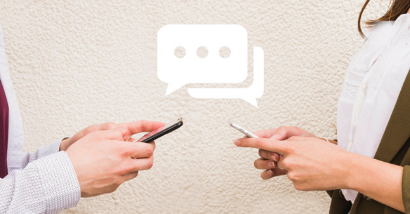

Machine Learning (ML) and Artificial Intelligence (AI) are paving ways to all aspects of the business. Not only making its place, but AI-ML solution is also redefining the business process for the better. Today, in this article, I am going to talk about one of the most delicate yet crucial business processes, which is customer service.

Businesses spend thousands of dollars on skilled customer service representatives and also in call centers sometimes to assure that their customers receive the best user experience. Now, this process is getting redefined by one of the most powerful and practical AI solutions, called, chatbots.

You might have seen and interacted with a chatbot on some website as these days a majority of the site keeps chatbots to take care of incoming website visitors. Yes, the concept is the same, but functionality, characteristics, and features are not. Customer service chatbots are somewhat different as they are smarter and have an acquaintance of distinct business processes, common issues faced by the customers, and resolutions of these common issues.

A chatbot can be text chatbot or voice chatbot. Both work in a similar manner, but they use different communication channels. Text chatbot uses live web chat for communication and voice chatbot can be a live web chat, a live phone app, or a voice assistant like Alexa, Cortana, etc. or it may appear in some other manners. In this blog post, when we refer to a chatbot, we refer to both types of chatbots.

With the invention of customer support chatbot, the whole process of customer service is redefined. Let me explain how the new customer care procedure looks like with a chatbot.

### 1. Professional greetings with same energy even for 398th conversation

Unlike human agents, the chatbot does not lose energy or passion after handling some customers. The chatbot greets customers with the same enthusiasm from the very first to the last customer conversation of the day.

Due to these amazing traits which instantly build positive vibes even in an angry customer, chatbot now made their way to the first interaction with customers in customer service.

### 2. Provide answers to queries in their native language

Hiring native agents who can speak with the same accent and use the vocabulary used by the specific customer is complex and expensive. On the other hand, a chatbot can be trained within a few hours by the expert chatbot development companies to use native vocabulary and accents in a conversation.

This trait of chatbot helps in clutching the conversation and gives a comfort level to the customer.

### 3. Personalize the conversation to make customers feel valued

The modern era chatbots are smarter than earlier. The chatbot development companies can integrate the chatbot with the database and CRM solution, so the chatbot can fetch information about the customer currently having a conversation. Using the fetched information, the chatbot can deliver more personalized responses. For example, greeting a customer by his name and offering help for the tasks he usually does every time he connects with the customer support. The personalized responses and experience delivered to the customer will make him feel valued.

This helps in improving customer delight, which further assures long term customer retention.

### 4. Resolve customer concerns faster

Chatbot providing customer services are often trained with various data of commonly asked questions and respective solutions. Thus, the chatbot can resolve common issues and concerns without any human intervention and also record customer feedback at the end of the conversation.

Chatbots developed by the best chatbot development company are smarter to understand and decode complex as well as vague questions and delivering satisfactory resolution for the same.

These traits of chatbot reduce human intervention and help in saving money and reducing TAT (Turn Around Time) in customer services.

### 5. Connect customer with the skilled human agent for resolution

Generally, the trained and carefully built chatbot can resolve 87% of queries and deliver exceptional customer services. However, there can be some cases, where chatbot comes across a unique issue, for which it does not have a solution. In such a scenario, it connects the customer with the most skilled agent that can resolve his issues. This assures the customer receives the expected solution and does not leave disappointed because customer service chatbot is not trained for that issue.

Additionally, the chatbot can further train itself with collected data. Thus, even if it could not resolve a unique issue for the first time, if the same issue gets reported again, the chatbot can resolve that.

### Wrapping up

Chatbot has completely transformed the traditional customer services for the better. It delivers assured benefits to businesses that use it.

We build custom customer service chatbot according to your business nature and required customer support. Contact us to know more.
